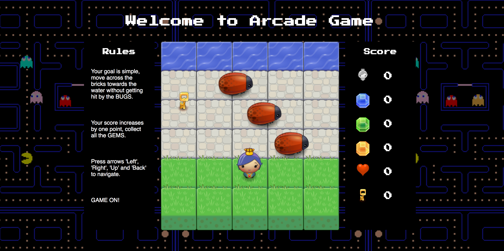

frontend-nanodegree-arcade-game
===============================

# Arcade Games are back

Welcome to the good old Arcade Game.
Inspired by my childhood game Tetris, I have included nostalgic elements here too.
Enjoy the music and moving background image.

## How to play

Open index.html in your browser, the game will automatically start. Use Left, Right, Up and Down arrow keys to navigate in the screen.
To WIN the game you need to go to the water 5 times. You will LOSE if you'll be hit 5 times.
Collect each gem for extra kick.

## Reference
Music taken from here: https://archive.org/details/TetrisThemeMusic
Background image taken from here: http://pacman.com/en/wp-content/themes/PACMAN/images/uploads/background_pattern.gif

Enjoy!
